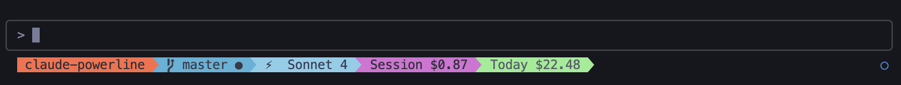

# Claude Powerline

A beautiful vim-style powerline statusline for Claude Code with real-time cost tracking, git integration, and custom themes.


[](https://www.npmjs.com/package/claude-powerline)

## Features

- **Vim-style powerline** - Beautiful segmented statusline with proper powerline arrows
- **Real-time cost tracking** - Session and daily usage costs using [ccusage](https://github.com/ryanschneider/ccusage)
- **Git integration** - Branch name, status indicators, ahead/behind counts
- **Dual themes** - Light and dark color schemes optimized for different terminals
- **Smart directory display** - Project-aware path showing with context
- **Zero configuration** - Works out of the box with Claude Code hooks
- **Font management** - Built-in powerline fonts installer

## Screenshots

### Default Theme



### Dark Theme


## Installation

### npm (Recommended)

```bash
npm install -g claude-powerline
```

### Install powerline fonts

For proper arrow display, install powerline fonts:

```bash
claude-powerline --install-fonts
```

After installation, set your terminal font to:

- Source Code Pro Powerline
- DejaVu Sans Mono Powerline  
- Ubuntu Mono Powerline

### From source

```bash
git clone https://github.com/user/claude-powerline.git
cd claude-powerline
npm install
npm run build
npm install -g .
```

## Usage

### Claude Code Integration

Add to your Claude Code `settings.json`:

```json
{
  "statusLine": {
    "type": "command",
    "command": "claude-powerline",
    "padding": 0
  }
}
```

### Command Line Options

```bash
# Default colorful theme
claude-powerline

# Dark theme for dark terminals
claude-powerline --dark

# Install powerline fonts
claude-powerline --install-fonts

# Show help
claude-powerline --help
```

### Manual Testing

```bash
echo '{
  "model": {"id": "claude-sonnet", "display_name": "Claude 3.5 Sonnet"}, 
  "workspace": {"current_dir": "/path/to/project", "project_dir": "/path/to/project"},
  "session_id": "abc123",
  "cwd": "/path/to/project",
  "transcript_path": "/path/to/transcript.json",
  "hook_event_name": "Status"
}' | claude-powerline
```

## Statusline Segments

The statusline displays information in colored segments from left to right:

| Segment | Description | Example |
|---------|-------------|---------|
| **Directory** | Current working directory or project name | `myproject` |
| **Git Branch** | Branch with status and ahead/behind | `master ✓ ↑2` |  
| **Model** | Current Claude model | `Claude 3.5 Sonnet` |
| **Session** | Current session usage cost | `Session $0.05` |
| **Daily** | Total daily usage cost | `Today $14.82` |

### Git Status Indicators

- `✓` **Clean** - No uncommitted changes
- `●` **Dirty** - Uncommitted changes present
- `⚠` **Conflicts** - Merge conflicts detected
- `↑3` **Ahead** - 3 commits ahead of remote
- `↓2` **Behind** - 2 commits behind remote

### Cost Information

Powered by [ccusage](https://github.com/ryanschneider/ccusage) integration:

- Shows current session and daily totals
- Displays `N/A` if session not found
- Shows `<$0.01` for small amounts

## Themes

**Colors Theme (Default):**

- Vibrant segments: orange → blue → purple → pink → green
- High contrast for light terminals

**Dark Theme (`--dark`):**

- Subdued segments: brown → gray → dark purple → charcoal
- Optimized for dark terminals

## Requirements

- Node.js ≥ 18.0.0
- Claude Code with statusline hook support
- Terminal with powerline font support (use `--install-fonts`)
- Git (optional, for git integration)

## Development

```bash
# Install dependencies
npm install

# Build TypeScript
npm run build

# Run tests
npm test

# Lint code
npm run lint

# Development mode with file watching
npm run dev
```

## Troubleshooting

**Arrows not displaying?**

1. Run `claude-powerline --install-fonts`
2. Restart terminal and set font to a powerline font
3. Ensure terminal supports Unicode

**Cost showing N/A?**

1. Verify [ccusage](https://github.com/ryanschneider/ccusage) can access Claude data
2. Check session ID matches current Claude session

**Git info missing?**

1. Ensure you're in a git repository
2. Check git is installed and in PATH

## Contributing

Contributions are welcome! Please feel free to submit issues or pull requests.

## License

This project is licensed under the [MIT License](LICENSE).
