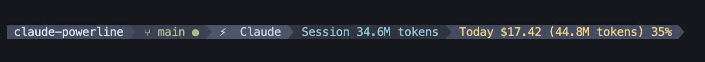
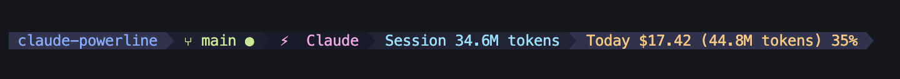
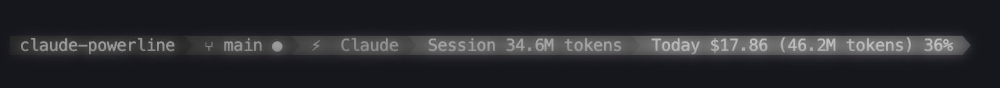
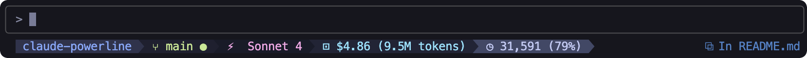

<div align="center">

# Claude Powerline

**A vim-style powerline statusline for Claude Code with real-time usage tracking, git integration, and custom themes.**


[](https://www.npmjs.com/package/@owloops/claude-powerline)

<table>
   <tr>
      <td align="center">
         <br>
         <strong>Dark</strong>
      </td>
      <td align="center">
         <br>
         <strong>Light</strong>
      </td>
   </tr>
   <tr>
      <td align="center">
         <br>
         <strong>Nord</strong>
      </td>
      <td align="center">
         <br>
         <strong>Tokyo Night</strong>
      </td>
   </tr>
   <tr>
      <td align="center">
         <br>
         <strong>Rose Pine</strong>
      </td>
      <td align="center">
         <br>
         <em>Create your own!</em>
      </td>
   </tr>
</table>
</div>

## Features

<table>
<tr>
<td width="50%" valign="top">

### Core Features

- **Vim-style powerline** with proper arrows and segments
- **Real-time usage tracking** with costs, tokens, and session blocks
- **Git integration** with branch, status, ahead/behind counts

</td>
<td width="50%" valign="top">

### Customization

- **Custom themes** with full color control
- **Budget monitoring** with percentage warnings
- **Flexible configuration** via JSON files and environment variables

</td>
</tr>
</table>

## Installation

### Requirements

- **Node.js 18+**
- **Claude Code**

### Setup

**Install powerline fonts:**

```bash
npx -y @owloops/claude-powerline --install-fonts
```

> [!WARNING]  
> Without powerline fonts, arrow separators display as placeholder characters (�). The default `--style=minimal` mode resolves it by not using the powerline unicode.

**Add to your Claude Code `settings.json`:**

```json
{
  "statusLine": {
    "type": "command", 
    "command": "npx -y @owloops/claude-powerline --style=powerline",
    "padding": 0
  }
}
```

> [!NOTE]  
> Using `npx` automatically downloads and runs the latest version, ensuring you always have the newest features and fixes without manual updates.

**Start a Claude session:** It appears at the bottom during conversations.



> [!TIP]  
> The statusline shows your **current directory name** (not "claude powerline") and updates with live usage data during Claude conversations.

## Usage

```bash
claude-powerline [OPTIONS]
```

Options are specified by command line flags. Overall configuration can also use environment variables or configuration files.

## Command Line Options

| Option | Values | Description |
|--------|--------|-------------|
| `--theme` | `dark` (default), `light`, `nord`, `tokyo-night`, `rose-pine`, `custom` | Set color theme |
| `--style` | `minimal` (default), `powerline` | Set separator style |
| `--usage` | `cost`, `tokens`, `both`, `breakdown` | Set usage display format |
| `--daily-budget` | `AMOUNT` | Set daily budget limit in USD |
| `--session-budget` | `AMOUNT` | Set session budget limit in USD |
| `--config` | `PATH` | Use custom config file path |
| `--install-fonts` | - | Install powerline fonts to system |
| `-h, --help` | - | Show help message |

### Usage Display Types

- **cost**: Show dollar amounts (`$0.05`)
- **tokens**: Show token counts (`1.2K tokens`)  
- **both**: Show both (`$0.05 (1.2K tokens)`)
- **breakdown**: Show detailed token breakdown (`1.2Kin + 0.8Kout + 1.5Kcached`)

## Examples

### Default Configuration

```bash
# Shows directory, git, model, session usage (tokens), today usage (both)
# Uses dark theme, minimal style, $50 daily budget
claude-powerline
```

### Theme and Style

```bash
# Nord theme with powerline arrows
claude-powerline --theme=nord --style=powerline

# Tokyo Night theme, minimal style
claude-powerline --theme=tokyo-night --style=minimal
```

### Usage Display

```bash
# Show token breakdown instead of costs
claude-powerline --usage=breakdown

# Set daily budget limit
claude-powerline --daily-budget=50
```

### Status Indicators

- **Git**: `✓` Clean, `●` Dirty, `⚠` Conflicts, `↑3` Ahead, `↓2` Behind remote
- **Budget**: `25%` Normal (under 50%), `+75%` Moderate (50-79%), `!85%` Warning (80%+)

## Configuration

Create config file:

```bash
# Copy example config from repository
curl -o ~/.claude/claude-powerline.json https://raw.githubusercontent.com/Owloops/claude-powerline/main/.claude-powerline.json
```

Configuration priority (top overrides bottom):

1. CLI arguments (`--theme`, `--style`, `--usage`, `--config`)
2. Environment variables (`CLAUDE_POWERLINE_THEME`, `CLAUDE_POWERLINE_STYLE`, `CLAUDE_POWERLINE_USAGE_TYPE`, `CLAUDE_POWERLINE_CONFIG`)
3. Config files (first found):
   - `./.claude-powerline.json` (project)
   - `~/.claude/claude-powerline.json` (user)  
   - `~/.config/claude-powerline/config.json` (XDG)
4. Default values

> [!NOTE]  
> Config files are reloaded automatically when changed - no need to restart Claude Code.

### Enable Additional Segments

```json
{
  "display": {
    "lines": [
      {
        "segments": {
          "directory": { "enabled": true },
          "git": { "enabled": true, "showSha": true },
          "model": { "enabled": true },
          "session": { "enabled": true, "type": "tokens" },
          "today": { "enabled": true, "type": "both" },
          "block": { "enabled": false, "type": "cost" },
          "tmux": { "enabled": true }
        }
      }
    ]
  }
}
```

### Multi-line Layout (Optional)

To prevent segment cutoff, configure multiple lines:

```json
{
  "display": {
    "lines": [
      {
        "segments": {
          "directory": { "enabled": true },
          "git": { "enabled": true },
          "model": { "enabled": true }
        }
      },
      {
        "segments": {
          "session": { "enabled": true, "type": "tokens" },
          "today": { "enabled": true, "type": "both" },
          "block": { "enabled": false, "type": "cost" },
          "tmux": { "enabled": true }
        }
      }
    ]
  }
}
```

> [!NOTE]  
> Claude Code system messages (e.g., Context left until auto-compact) may truncate the status line mid-sequence. Multi-line layouts help prevent segment cutoff.

### Custom Colors

To customize colors, copy dark or light theme colors from `src/themes/` in the repository, then modify:

```json
{
  "theme": "custom",
  "colors": {
    "custom": {
      "directory": { "bg": "#ff6600", "fg": "#ffffff" },
      "git": { "bg": "#0066cc", "fg": "#ffffff" },
      "model": { "bg": "#9900cc", "fg": "#ffffff" },
      "session": { "bg": "#cc0099", "fg": "#ffffff" },
      "today": { "bg": "#00cc66", "fg": "#000000" },
      "block": { "bg": "#cc6600", "fg": "#ffffff" },
      "tmux": { "bg": "#228b22", "fg": "#ffffff" }
    }
  }
}
```

## Custom Segments

Extend the statusline by wrapping the command with shell composition:

### Add Custom Segments

Use `tput` for colors that match your terminal theme:

```json
{
  "statusLine": {
    "type": "command",
    "command": "npx -y @owloops/claude-powerline && echo \"$(tput setab 4)$(tput setaf 15) ⏱ $(date +%H:%M) $(tput sgr0)\"",
    "padding": 0
  }
}
```

Common `tput` colors:

- `setab 1` (red bg) `setaf 15` (white fg)
- `setab 2` (green bg) `setaf 0` (black fg)
- `setab 4` (blue bg) `setaf 15` (white fg)
- `setab 6` (cyan bg) `setaf 0` (black fg)

### Custom Wrapper Script

Create `~/.local/bin/my-statusline`:

```bash
#!/bin/bash
# Option 1: Same line (continuous)
cat | npx -y @owloops/claude-powerline | tr -d '\n'
echo -n "$(tput setab 6)$(tput setaf 0) ⏱ $(date +%H:%M) $(tput sgr0)"
echo "$(tput setab 2)$(tput setaf 0) ☁ $(curl -s wttr.in?format=%t 2>/dev/null || echo '?') $(tput sgr0)"

# Option 2: Separate lines (multiline)
# cat | npx -y @owloops/claude-powerline
# echo "$(tput setab 6)$(tput setaf 0) ⏱ $(date +%H:%M) $(tput sgr0)"
# echo "$(tput setab 2)$(tput setaf 0) ☁ $(curl -s wttr.in?format=%t 2>/dev/null || echo '?') $(tput sgr0)"
```

Then use it in `settings.json`:

```json
{
  "statusLine": {
    "type": "command",
    "command": "/full/path/to/my-statusline",
    "padding": 0
  }
}
```

> [!TIP]  
> Shell composition provides unlimited flexibility while keeping the core package secure - no arbitrary command execution needed. Use full absolute paths or ensure scripts are in your PATH.

## Environment Variables

```bash
export CLAUDE_POWERLINE_THEME=dark
export CLAUDE_POWERLINE_STYLE=powerline
export CLAUDE_POWERLINE_USAGE_TYPE=tokens
export CLAUDE_POWERLINE_CONFIG=/path/to/config.json
```

## Troubleshooting

**Arrows not displaying?** Run `claude-powerline --install-fonts` and set terminal font to a powerline-patched font.

**Cost showing N/A?** Verify [ccusage](https://github.com/ryanschneider/ccusage) is working and session ID matches.

**Tmux segment not showing?** Ensure you're in a tmux session and enable it in config.

## Contributing

Contributions are welcome! Please feel free to submit issues or pull requests.

## License

This project is licensed under the [MIT License](LICENSE).
