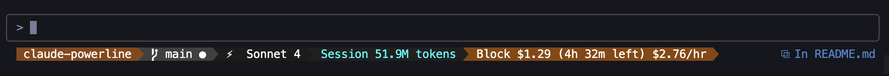
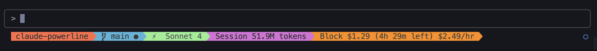

# Claude Powerline

A vim-style powerline statusline for Claude Code with real-time usage tracking, git integration, and custom themes.


[](https://www.npmjs.com/package/@owloops/claude-powerline)

## Features

- **Vim-style powerline** with proper arrows and segments
- **Real-time usage tracking** with costs, tokens, and session blocks
- **Git integration** with branch, status, ahead/behind counts
- **Custom themes** with full color control
- **Budget monitoring** with percentage warnings
- **Flexible configuration** via JSON files and environment variables

## Installation

```bash
npx -y @owloops/claude-powerline --install-fonts  # Install powerline fonts
```

Add to your Claude Code `settings.json`:

```json
{
  "statusLine": {
    "type": "command",
    "command": "npx -y @owloops/claude-powerline",
    "padding": 0
  }
}
```

> **Note:** Using `npx` automatically downloads and runs the latest version, ensuring you always have the newest features and fixes without manual updates.

## Usage

```bash
# Basic usage (single line with directory, git, model, session, today)
claude-powerline

# Dark theme
claude-powerline --theme=dark

# Show tokens instead of costs  
claude-powerline --usage=tokens

# Show token breakdown (input/output)
claude-powerline --usage=breakdown

# Set budgets with warnings
claude-powerline --daily-budget=50 --session-budget=20
```

## Styles

Set separator style:

- **powerline** - Powerline arrows (requires Powerline fonts)
- **minimal** - Rectangular segments, no separators (default)

```bash
claude-powerline --style=powerline
```

## Screenshots

### Dark Theme (Default)



### Light Theme



## Default Segments

By default displays: `Directory | Git Branch | Model | Session Usage | Today Usage`

### Usage Display Types

- **cost**: Show dollar amounts (`$0.05`)
- **tokens**: Show token counts (`1.2K tokens`)
- **both**: Show both (`$0.05 (1.2K tokens)`)
- **breakdown**: Show detailed token breakdown (`1.2Kin + 0.8Kout + 1.5Kcached`)

### Git Status Indicators

- `✓` Clean, `●` Dirty, `⚠` Conflicts
- `↑3` Ahead, `↓2` Behind remote

### Budget Indicators

- `25%` Normal (under 50%)
- `+75%` Moderate (50-79%)  
- `!85%` Warning (80%+, configurable)

## Configuration

Create config file:

```bash
# Copy example config from repository
curl -o ~/.claude/claude-powerline.json https://raw.githubusercontent.com/Owloops/claude-powerline/main/.claude-powerline.json
```

Config files loaded in priority order:

1. CLI arguments (`--theme`, `--usage`, `--config`)
2. Environment variables (`CLAUDE_POWERLINE_THEME`, `CLAUDE_POWERLINE_USAGE_TYPE`, `CLAUDE_POWERLINE_CONFIG`)
3. `./.claude-powerline.json` (project)
4. `~/.claude/claude-powerline.json` (user)  
5. `~/.config/claude-powerline/config.json` (XDG)

### Enable Additional Segments

```json
{
  "display": {
    "lines": [
      {
        "segments": {
          "directory": { "enabled": true },
          "git": { "enabled": true, "showSha": true },
          "model": { "enabled": true },
          "session": { "enabled": true, "type": "tokens" },
          "today": { "enabled": true, "type": "both" },
          "block": { "enabled": false, "type": "cost" },
          "tmux": { "enabled": true }
        }
      }
    ]
  }
}
```

### Multi-line Layout (Optional)

To prevent segment cutoff, configure multiple lines:

```json
{
  "display": {
    "lines": [
      {
        "segments": {
          "directory": { "enabled": true },
          "git": { "enabled": true },
          "model": { "enabled": true }
        }
      },
      {
        "segments": {
          "session": { "enabled": true, "type": "tokens" },
          "today": { "enabled": true, "type": "both" },
          "block": { "enabled": false, "type": "cost" },
          "tmux": { "enabled": true }
        }
      }
    ]
  }
}
```

### Built-in Themes

Use `light` or `dark` themes with no configuration needed:

```bash
claude-powerline --theme=light  # or --theme=dark (default)
```

### Custom Colors

To customize colors, copy dark or light theme colors from `src/themes/` in the repository, then modify:

```json
{
  "theme": "custom",
  "colors": {
    "custom": {
      "directory": { "bg": "#ff6600", "fg": "#ffffff" },
      "git": { "bg": "#0066cc", "fg": "#ffffff" },
      "model": { "bg": "#9900cc", "fg": "#ffffff" },
      "session": { "bg": "#cc0099", "fg": "#ffffff" },
      "today": { "bg": "#00cc66", "fg": "#000000" },
      "block": { "bg": "#cc6600", "fg": "#ffffff" },
      "tmux": { "bg": "#228b22", "fg": "#ffffff" }
    }
  }
}
```

## Environment Variables

```bash
export CLAUDE_POWERLINE_THEME=dark
export CLAUDE_POWERLINE_USAGE_TYPE=tokens
export CLAUDE_POWERLINE_CONFIG=/path/to/config.json
```

## Requirements

- Node.js ≥ 18.0.0
- Terminal with powerline font support
- Git (optional, for git integration)

## Troubleshooting

**Arrows not displaying?** Run `claude-powerline --install-fonts` and set terminal font to a powerline-patched font.

**Cost showing N/A?** Verify [ccusage](https://github.com/ryanschneider/ccusage) is working and session ID matches.

**Tmux segment not showing?** Ensure you're in a tmux session and enable it in config.

## Contributing

Contributions are welcome! Please feel free to submit issues or pull requests.

## License

This project is licensed under the [MIT License](LICENSE).
